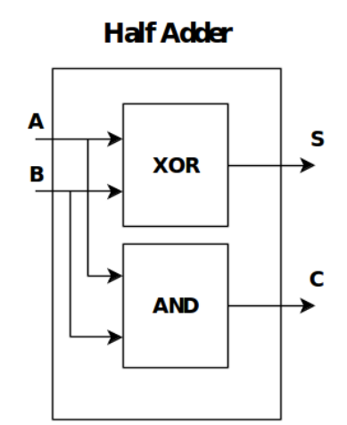
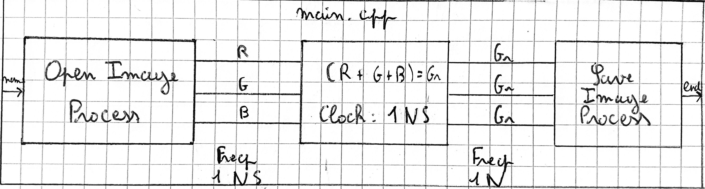

# Lab System C

# Setup :

### Installation :

```bash
# Download packages
wget http://www.accellera.org/images/downloads/standards/systemc/systemc-2.3.3.gz
# Unpack the packages
tar -xzf systemc-2.3.3.gz
sudo mkdir /usr/local/systemc-2.3.3/
cd systemc-2.3.3 && mkdir objdir && cd objdir
# Installation
sudo ../configure --prefix=/usr/local/systemc-2.3.3/
sudo make -j$(nproc)
sudo make install
```

### Visual Studio Code

```bash
# Add to include path
/usr/local/systemc-2.3.3/
/usr/local/systemc-2.3.3/include
```

# Half adder :

### Half Adder RTL model :



A Half Adder have two signals in et two signals out like in the picture. A et B are bool signal who represent the two bit to add, and S and C are bool signal too who represent the SUM and the CARRY of the add of A and B. 

Our Half Adder are compose of two file `adder.h` and `adder.cpp`. The file `adder.h` declare all signal variable and all methodes, and the file `adder.cpp` implements all methodes and the module `Adder`.

### Simulation environement :

After that we create a file main.cpp, who create an Half Adder and change the value of A and B to simulate the behavior of our Half Adder.

### Check, TraceFile and assertion :

To check the good behaviour of our Half Adder we try tree différents way : 

- First we print all the result on the terminal :
    
    
    
- Secondly we create a tracefile.vcd, and we use GTKWave to visualize the signal
    
    
    
- Thirdly we implemented assertion to check the good computing (this way it’s better for test huge behavior), if we have a wrong behavior the simulation stop and write an error


This three methods permite to check the good behavior of the model.

# Nbit Adder :

## Full adder :


First we create a Full Adder with the behaviour of the picture above. The structure of the code are like previously on the Half Adder. And all check as prevously are implement.


## Nbit adder :


For this part we just follow the screen of an Nbit Adder, and we just connected N Full Adder together to create the behavior expected. We also create all the verification stuff (Assertion, Random input generation and TraceFile, even is not really easy to saw the signal)


# Grey Scale :

For create a clocked image grey scaler we create two functions of our `Grey Scale`, a `GreyScaleProcess()` and a `clock()`, the `clock()` are launch in a thread with a frequence of 1 nano seconde and and `GreyScaleProcess()` are sensitive to the rising edge of the `clock()`.

To compute the GreyScale, we use a simple function : 

```cpp
sc_uint<8> grey = (R.read() + G.read() + B.read()) / 3;
```

And to check the behavior of our GreyScale with also create a Image Process, who permite to read and save a BMP image. Just BMP image because of the header size.


As we can see the behaviour seems good.

# Hierarchical Channels :

 For this part we just adapted the previous code to transmite informations on channels. So for that we separate all process in specific and individual process systemC : `read_image.h`, `save_image.h` and `grey_scale_h.h`. We also create a simulation environement in a `main.cpp`




As we can see the behaviour seems good.
